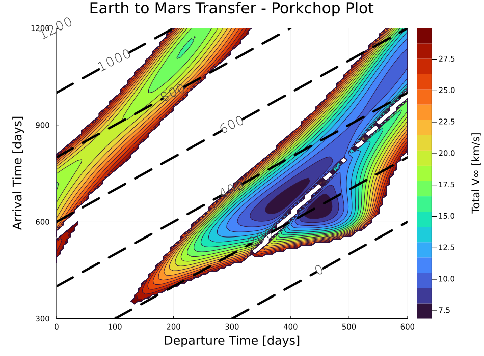

# Lambert

[](https://github.com/HAMMERHEAD-Space/Lambert.jl/actions/workflows/CI.yml?query=branch%3Amaster)
[](https://codecov.io/gh/HAMMERHEAD-Space/Lambert.jl)
[](https://github.com/invenia/BlueStyle)
[](https://github.com/JuliaTesting/Aqua.jl)
[](https://doi.org/10.5281/zenodo.17109956)

This package provides multiple Lambert problem solvers ported from the Python `lamberthub` library.

## Available Solvers

### Universal Solvers
- **GoodingSolver**: R. H. Gooding's algorithm (1990) - Robust and accurate
- **IzzoSolver**: D. Izzo's modern algorithm (2015) - High performance, few iterations required
- **ValladoSolver**: D. A. Vallado's universal formulation with bisection (2013) - Guaranteed convergence
- **AroraSolver**: N. Arora & R. P. Russell's cosine transformation (2013) - Fast and robust

### P-Solvers  
- **BattinSolver**: R. H. Battin's elegant algorithm (1984) - Improves on Gauss, removes 180° singularity
- **GaussSolver**: C. F. Gauss's original method (1809) - Historical algorithm, limited accuracy

### Eccentricity-Based Solvers
- **AvanziniSolver**: G. Avanzini's eccentricity-based method (2008) - Single revolution only

## Potential Future Solvers
- **LancasterBlanchardSolver**: E. R. Lancaster & R. C. Blanchard's unified method (1969) - Industry standard
- **PrussingSolver**: J. E. Prussing's p-iteration method (2000) - Educational and multi-rev optimization
- **KlumppSolver**: A. R. Klumpp's spacecraft onboard algorithm (1999) - Fast convergence, minimal memory
- **OlympioMarmoratSolver**: J. T. Olympio & J. P. Marmorat's global optimization (2007) - Handles multiple minima
- **SimsFlanagainSolver**: J. A. Sims & S. N. Flanagan's low-thrust method (1999) - Continuous thrust trajectories

## Usage

This package provides two interfaces for solving Lambert problems:

### Method 1: Object-Oriented Interface (Recommended)

```julia
using AstroProblemsLambert

# Define the problem
μ = 3.986004418e5  # Earth's gravitational parameter [km³/s²]
r1 = [15945.34, 0.0, 0.0]  # Initial position [km]
r2 = [12214.83899, 10249.46731, 0.0]  # Final position [km]  
tof = 76.0 * 60  # Time of flight [seconds]

# Create the Lambert problem
problem = LambertProblem(μ, r1, r2, tof)

# Choose a solver with parameters
solver = GoodingSolver(
    M = 0,           # Number of revolutions
    prograde = true, # Direction of motion
    low_path = true, # Path selection
    maxiter = 35,    # Maximum iterations
    atol = 1e-5,     # Absolute tolerance
    rtol = 1e-7      # Relative tolerance
)

# Solve
solution = solve(problem, solver)

# Extract results
v1 = solution.v1        # Initial velocity vector [km/s]
v2 = solution.v2        # Final velocity vector [km/s]
numiter = solution.numiter  # Number of iterations used
tpi = solution.tpi      # Time per iteration [seconds]
retcode = solution.retcode  # :SUCCESS, :MAXIMUM_ITERATIONS, etc.
```

### Method 2: Direct Algorithm Calls (lamberthub-style)

```julia
using AstroProblemsLambert

# Define the problem parameters
μ = 3.986004418e5  # Earth's gravitational parameter [km³/s²]
r1 = [15945.34, 0.0, 0.0]  # Initial position [km]
r2 = [12214.83899, 10249.46731, 0.0]  # Final position [km]  
tof = 76.0 * 60  # Time of flight [seconds]

# Call algorithms directly (returns tuples)
v1, v2, numiter, tpi = gooding1990(μ, r1, r2, tof, 0, true, true, 35, 1e-5, 1e-7)
v1, v2 = izzo2015(μ, r1, r2, tof)  # Simpler return for some solvers
v1, v2, numiter, tpi = battin1984(μ, r1, r2, tof)

# Available direct functions:
# - gooding1990(μ, r1, r2, tof, M=0, prograde=true, low_path=true, maxiter=35, atol=1e-5, rtol=1e-7)
# - izzo2015(μ, r1, r2, tof, M=0, prograde=true, low_path=true, maxiter=35, atol=1e-5, rtol=1e-7)
# - battin1984(μ, r1, r2, tof, M=0, prograde=true, low_path=true, maxiter=35, atol=1e-5, rtol=1e-7)
# - gauss1809(μ, r1, r2, tof, M=0, prograde=true, low_path=true, maxiter=250, atol=1e-5, rtol=1e-7)
# - vallado2013(μ, r1, r2, tof, M=0, prograde=true, low_path=true, maxiter=100, atol=1e-5, rtol=1e-7)
# - arora2013(μ, r1, r2, tof, M=0, prograde=true, low_path=true, maxiter=35, atol=1e-5, rtol=1e-7)
# - avanzini2008(μ, r1, r2, tof, M=0, prograde=true, low_path=true, maxiter=35, atol=1e-5, rtol=1e-7)
```

### Solver Parameters

Each solver supports different parameters based on their implementation:

**Common Parameters:**
- **M**: Number of revolutions (0 for direct transfer)
- **prograde**: Direction of motion (true for prograde, false for retrograde)
- **maxiter**: Maximum number of iterations

**Parameter Support by Solver:**

| Solver | M | prograde | low_path | maxiter | atol | rtol | Special |
|--------|---|----------|----------|---------|------|------|---------|
| Gooding | ✓ | ✓ | ✓ | ✓ | ✓ | ✓ | - |
| Izzo | ✓ | ✓ | ✓ | ✓ | ✓ | ✓ | - |
| Battin | ✓ | ✓ | ✓ | ✓ | ✓ | ✓ | - |
| Vallado | ✓* | ✓ | ✗ | ✓ | ✗ | ✓ | - |
| Gauss | ✓ | ✓ | ✓ | ✓ | ✓ | ✓ | - |
| Arora | ✓ | ✓ | ✗ | ✓ | ✓ | ✗ | - |
| Avanzini | ✓* | ✓ | ✗ | ✓ | ✓ | ✓ | - |

*Only M=0 supported, †Multi-rev fallback available

### Examples

```julia
# Different transfer types
direct_solver = GoodingSolver(M=0, prograde=true)
retrograde_solver = GoodingSolver(M=0, prograde=false)  
high_path_solver = GoodingSolver(M=0, low_path=false)

# Multi-revolution (supported by many solvers)
multi_rev_solver = IzzoSolver(M=1, prograde=true)

# High precision
precise_solver = IzzoSolver(atol=1e-12, rtol=1e-14)
```

## Solver Characteristics

| Solver | Accuracy | Speed | Multi-Rev | Robustness | Notes |
|--------|----------|-------|-----------|------------|-------|
| Gooding | Excellent | Fast | ✓ | High | Most reliable overall |
| Izzo | Excellent | Very Fast | ✓ | High | Modern, highly optimized |
| Vallado | Good | Slow | ✓ | Very High | Guaranteed convergence |
| Battin | Good | Medium | ✓ | Medium | Classic, well-tested |
| Gauss | Poor | Medium | ✓† | Low | Historical interest only |
| Arora | Excellent | Fast | ✓ | High | Fast cosine transformation |
| Avanzini | Good | Medium | ✗ | Medium | Eccentricity-based |

†May have convergence issues for multi-revolution cases  

## Testing

The package includes comprehensive tests ported from LambertHub:

Test cases include examples from:
- Vallado's "Fundamentals of Astrodynamics and Applications"
- Curtis's "Orbital Mechanics for Engineering Students" 
- Battin's "An Introduction to the Mathematics and Methods of Astrodynamics"
- GMAT-generated hyperbolic trajectories
- Der's astrodynamics examples

## AstroCoords.jl Integration

This package is fully compatible with [AstroCoords.jl](https://github.com/JuliaSpace/AstroCoords.jl), allowing you to work directly with different coordinate systems.

### Usage with Keplerian Coordinates

```julia
using AstroProblemsLambert
using AstroCoords

# Earth's gravitational parameter
μ_earth = 3.986004418e5  # [km³/s²]

# Define initial and final orbital elements (Keplerian coordinates)
# Initial orbit: circular at 7000 km altitude
kep1 = Keplerian([
    7000.0,    # Semi-major axis [km]
    0.0,       # Eccentricity [-]
    0.0,       # Inclination [rad] 
    0.0,       # RAAN [rad]
    0.0,       # Argument of periapsis [rad]
    0.0        # True anomaly [rad]
], μ_earth)

# Final orbit: elliptical orbit
kep2 = Keplerian([
    8500.0,    # Semi-major axis [km]
    0.1,       # Eccentricity [-]
    0.2,       # Inclination [rad]
    0.1,       # RAAN [rad] 
    0.3,       # Argument of periapsis [rad]
    π/4        # True anomaly [rad]
], μ_earth)

# Time of flight
tof = 3600.0  # [seconds]

# Create Lambert problem directly from Keplerian coordinates
problem = LambertProblem(μ_earth, kep1, kep2, tof)

# Solve with your preferred algorithm
solver = IzzoSolver()
solution = solve(problem, solver)

println("Transfer velocities:")
println("v1 = $(solution.v1) km/s")
println("v2 = $(solution.v2) km/s")
println("Solution status: $(solution.retcode)")
```

### Mixed Coordinate Systems

You can also mix different coordinate types:

```julia
using AstroCoords

# Start with Cartesian coordinates
cart1 = Cartesian([7000.0, 0.0, 0.0, 0.0, 7.546, 0.0])  # [km, km/s]

# End with Modified Equinoctial coordinates  
modeq2 = ModEq([
    8000.0,   # Semi-major axis [km]
    0.05,     # h = e*sin(ω+Ω)
    -0.03,    # k = e*cos(ω+Ω)
    0.1,      # p = tan(i/2)*sin(Ω)
    0.08,     # q = tan(i/2)*cos(Ω)
    0.5       # L = Ω + ω + ν [rad]
], μ_earth)

# Create problem with mixed coordinate types
problem_mixed = LambertProblem(μ_earth, cart1, modeq2, 2400.0)
solution_mixed = solve(problem_mixed, GoodingSolver())
```

### Coordinate Conversion Benefits

The AstroCoords integration automatically handles:
- **Position extraction**: Only position components are used for Lambert problem
- **Coordinate conversion**: Automatic conversion to Cartesian for internal calculations
- **Type preservation**: Solution velocities maintain appropriate vector types
- **Validation**: Consistent coordinate system validation across inputs

This makes it easy to integrate Lambert transfers into broader orbital mechanics workflows using your preferred coordinate representations.

## Porkchop Plots (Plots.jl Extension)

This package includes an optional extension for creating porkchop plots with Plots.jl. A porkchop plot is a contour plot that visualizes transfer requirements (ΔV, excess velocity) across different departure and arrival times, essential for mission planning in astrodynamics.



### Installation

The porkchop plot functionality requires Plots.jl to be installed:

```julia
using Pkg
Pkg.add("Plots")
```

Once Plots.jl is installed, the extension will automatically load when you use both packages:

```julia
using Lambert
using Plots  # This activates the LambertPlotsExt extension
```

**For a complete working example**, see [`examples/porkchop_example.jl`](examples/porkchop_example.jl) which demonstrates:
- Earth-Mars interplanetary transfer
- Planetary orbit propagation with AstroCoords.jl
- Multiple quantity visualization with subplots
- Time scaling and TOF contours


### Available Quantities

The `plot_quantity` parameter supports:

- **`:total_dv`** (default): Total ΔV required (sum of departure and arrival maneuvers)
- **`:total_excess_velocity`**: Total excess velocity (V∞) - same as total_dv but with V∞ notation
- **`:dv_departure`** / **`:excess_velocity_departure`**: Departure ΔV or excess velocity
- **`:dv_arrival`** / **`:excess_velocity_arrival`**: Arrival ΔV or excess velocity

### Customization Options

```julia
p = porkchop_plot(μ, state1_func, state2_func, departure_times, arrival_times;
    solver = IzzoSolver(),              # Lambert solver algorithm
    ensemble_alg = EnsembleThreads(),   # Parallel execution (Serial, Threads, Distributed)
    max_deltav = 20.0,                  # Maximum ΔV to display [km/s]
    levels = nothing,                   # Contour levels (auto if nothing)
    tof_contours = true,                # Overlay time-of-flight lines
    tof_spacing = 100*86400,            # TOF line spacing (e.g., every 100 days)
    time_scale = 86400.0,               # Scale factor for axis display (seconds→days)
    plot_quantity = :total_dv,          # Quantity to plot (or vector for subplots)
    title = "Porkchop Plot",
    xlabel = "Departure Time",
    ylabel = "Arrival Time",
    color = :turbo                      # Colormap (:turbo, :plasma, :jet, etc.)
)
```

### Time-of-Flight Contours

Porkchop plots include diagonal time-of-flight (TOF) lines by default, showing trajectories with equal flight duration:

- Black dashed lines indicate constant TOF
- Lines are labeled with the TOF value
- Automatically scaled to match your time units
- Control with `tof_contours`, `tof_levels`, and `tof_spacing` parameters

## References

### Primary Algorithm References

1. **Gooding, R. H.** (1990). A procedure for the solution of Lambert's orbital boundary-value problem. *Celestial Mechanics and Dynamical Astronomy*, 48(2), 145-165. DOI: [10.1007/BF00049511](https://doi.org/10.1007/BF00049511)

2. **Izzo, D.** (2015). Revisiting Lambert's problem. *Celestial Mechanics and Dynamical Astronomy*, 121(1), 1-15. DOI: [10.1007/s10569-014-9587-y](https://doi.org/10.1007/s10569-014-9587-y)

3. **Battin, R. H., & Vaughan, R. M.** (1984). An elegant Lambert algorithm. *Journal of Guidance, Control, and Dynamics*, 7(6), 662-670. DOI: [10.2514/3.19216](https://doi.org/10.2514/3.19216)

4. **Vallado, D. A.** (2013). *Fundamentals of astrodynamics and applications* (4th ed.). Microcosm Press and Springer. ISBN: 978-1881883180

5. **Arora, N., & Russell, R. P.** (2013). A fast and robust multiple revolution Lambert algorithm using a cosine transformation. *AAS/AIAA Astrodynamics Specialist Conference*, Paper AAS 13-728, Hilton Head, South Carolina.

6. **Gauss, C. F.** (1809). *Theoria motus corporum coelestium in sectionibus conicis solem ambientium*. F. Perthes and I. H. Besser, Hamburg. [Original Latin work on celestial mechanics including Lambert's problem]

7. **Avanzini, G.** (2008). A simple Lambert algorithm. *Journal of Guidance, Control, and Dynamics*, 31(6), 1587-1594. DOI: [10.2514/1.35031](https://doi.org/10.2514/1.35031)

8. **Lancaster, E. R., & Blanchard, R. C.** (1969). A unified form of Lambert's theorem. *NASA Technical Note D-5368*. [Industry standard universal variable method]

9. **Klumpp, A. R.** (1999). Performance comparison of Lambert and Kepler algorithms. *AAS/AIAA Astrodynamics Specialist Conference*, Paper AAS 99-139, Girdwood, Alaska. [Real-time spacecraft applications]

10. **Prussing, J. E.** (2000). A class of optimal two-impulse rendezvous using multiple-revolution Lambert solutions. *Journal of the Astronautical Sciences*, 48(2-3), 131-148. [p-iteration educational method]

11. **Sims, J. A., & Flanagan, S. N.** (1999). Preliminary design of low-thrust interplanetary missions. *AAS/AIAA Astrodynamics Specialist Conference*, Paper AAS 99-338. [Low-thrust trajectory optimization]

12. **Olympio, J. T., & Marmorat, J. P.** (2007). Global trajectory optimization: On the selection of the objective function. *Celestial Mechanics and Dynamical Astronomy*, 98(2), 75-93. DOI: [10.1007/s10569-007-9072-y](https://doi.org/10.1007/s10569-007-9072-y) [Global optimization approach]

### Historical and Theoretical Background

13. **Lambert, J. H.** (1761). *Insigniores orbitae cometarum proprietates*. Augsburg: Eberhard Klett. [Original Lambert's problem formulation]

14. **Battin, R. H.** (1987). *An Introduction to the Mathematics and Methods of Astrodynamics* (Revised Edition). AIAA Education Series. ISBN: 978-1563473432 [Comprehensive treatment of Lambert's problem]

15. **Curtis, H. D.** (2013). *Orbital Mechanics for Engineering Students* (3rd ed.). Butterworth-Heinemann. ISBN: 978-0080977478 [Engineering-focused Lambert problem treatment]

### Implementation and Validation References

16. **Martínez Garrido, J., et al.** LambertHub: A Python library for Lambert's problem solvers. GitHub repository: [https://github.com/jorgepiloto/lamberthub](https://github.com/jorgepiloto/lamberthub) [Original Python implementation this package is based on]

17. **Der, G. J.** (1997). The superior Lambert algorithm. *AAS/AIAA Astrodynamics Conference*, Paper AAS 97-720, Sun Valley, Idaho. [Advanced validation test cases]

### Performance and Numerical Analysis

18. **Roth, W.** (1996). Multiple revolution solutions for Lambert's problem. *AAS/AIAA Spaceflight Mechanics Meeting*, Paper AAS 96-152, Austin, Texas.

19. **Thompson, R. C.** (1964). A unified algorithm for Lambert's problem. *Journal of Guidance, Control, and Dynamics*, 7(2), 139-145. [Early computer-era algorithm development]

## Citing

If you use `Lambert.jl` in your work, please consider citing it.

```bibtex
@software{jordan_murphy_2025_17109957,
  author       = {Jordan Murphy},
  title        = {HAMMERHEAD-Space/Lambert.jl},
  publisher    = {Zenodo},
  doi          = {10.5281/zenodo.17109957},
  url          = {https://doi.org/10.5281/zenodo.17109957},
  swhid        = {swh:1:dir:bb8ba970cdf8762af1f94d29e26c69a7ca0cac27
                   ;origin=https://doi.org/10.5281/zenodo.17109956;vi
                   sit=swh:1:snp:58a54818f822c7f750eeca5c512a79612a72
                   b2c1;anchor=swh:1:rel:846dc4b04c1dd3667ee61fe5a4b6
                   22916278d3b8;path=HAMMERHEAD-Space-Lambert.jl-
                   ba6bde4
                  },
}
```

## Acknowledgments

This implementation is based on the excellent Python `lamberthub` library by Jorge Martínez Garrido and contributors https://github.com/jorgepiloto/lamberthub. The original algorithms and test cases have been carefully ported to Julia while maintaining numerical accuracy and performance characteristics.
